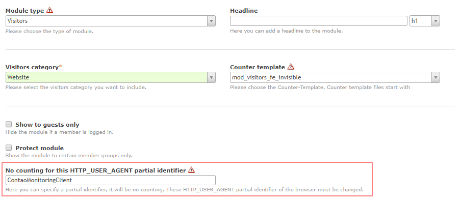

# Configuration

Get information about the configuration.

## Automatic execution

The Monitoring system is configured to check all webseite once per hour. It is registered at the Contao internal Cron with hourly execution.

To ensure, the Contao internal Cron is executed correct, a real Cron has to be installed. Read the following chapter for further information.

## Trigger via Cron

Login via SSH to your system.

To edit or create your own crontab file, type the following command at the UNIX / Linux shell prompt:

```bash
$ crontab -e
```

Insert the following row \(replace `your-domain.de` with the domain of yout system\):

```bash
0 * * * * /usr/bin/wget -O - -q http://your-domain.de/system/cron/cron.php
```

This will trigger the Contao Cron once every hour.

For Contao 4.4 it has to look like this:

```bash
0 * * * * /usr/bin/wget -O - -q http://your-domain.de/_contao/cron
```

### Do I have to restart cron after changing the crontable file?

No. Cron will examine the modification time on all crontabs and reload those which have changed. Thus cron need not be restarted whenever a crontab file is modified.

### Where can I get more information about Cron?

Have a look at this page: [https://www.cyberciti.biz/faq/how-do-i-add-jobs-to-cron-under-linux-or-unix-oses](https://www.cyberciti.biz/faq/how-do-i-add-jobs-to-cron-under-linux-or-unix-oses/)

## 

When a monitored system uses tools to record access, the hourly monitoring request will influence these data.

This can be avoided with filtering the recorded access via User-Agent request header. The Monitoring system sends the string `ContaoMonitoringClient` with each request.

For example using the Contao extension `[visitors]`, the User-Agent filter can be defined in the module:



Using other tools or systems, this filter may be different.