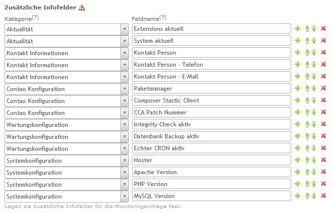

# Settings

Get information about the settings.

## System settings

> **ToDo** Describe system settings

## Example for additional info fields

Add this to your `system/config/localconfig.php` ...

    $GLOBALS['TL_CONFIG']['monitoringAdditionalInfoFields'] = 'a:15:{i:0;a:2:{s:8:"category";s:9:"actuality";s:4:"name";s:18:"Extensions aktuell";}i:1;a:2:{s:8:"category";s:9:"actuality";s:4:"name";s:14:"System aktuell";}i:2;a:2:{s:8:"category";s:7:"contact";s:4:"name";s:14:"Kontakt Person";}i:3;a:2:{s:8:"category";s:7:"contact";s:4:"name";s:24:"Kontakt Person - Telefon";}i:4;a:2:{s:8:"category";s:7:"contact";s:4:"name";s:23:"Kontakt Person - E-Mail";}i:5;a:2:{s:8:"category";s:6:"contao";s:4:"name";s:12:"Paketmanager";}i:6;a:2:{s:8:"category";s:6:"contao";s:4:"name";s:23:"Composer Stastic Client";}i:7;a:2:{s:8:"category";s:6:"contao";s:4:"name";s:16:"CCA Patch Nummer";}i:8;a:2:{s:8:"category";s:11:"maintenance";s:4:"name";s:21:"Integrity-Check aktiv";}i:9;a:2:{s:8:"category";s:11:"maintenance";s:4:"name";s:22:"Datenbank Backup aktiv";}i:10;a:2:{s:8:"category";s:11:"maintenance";s:4:"name";s:17:"Echter CRON aktiv";}i:11;a:2:{s:8:"category";s:6:"system";s:4:"name";s:6:"Hoster";}i:12;a:2:{s:8:"category";s:6:"system";s:4:"name";s:14:"Apache Version";}i:13;a:2:{s:8:"category";s:6:"system";s:4:"name";s:11:"PHP Version";}i:14;a:2:{s:8:"category";s:6:"system";s:4:"name";s:13:"MySQL Version";}}';

... and you will get the following additional info fields:

> **Caution**
> 
> This operation could destroy your configuration file.
> 
> Ensure that there is a backup copy!